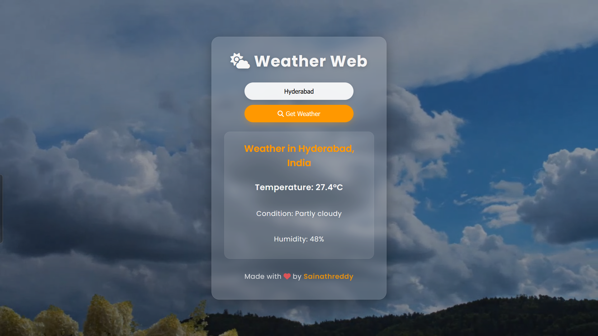

# Weather Web Application

  <h2><a href="https://sainath-666.github.io/Weather_Application_2/" target="_blank">🌦️ Live Demo</a></h2>
  
  

## About

Weather Web is a modern, responsive web application that provides real-time weather information for any city around the world. The application features dynamic backgrounds that change based on the current weather conditions, creating an immersive user experience.

## Features

- 🔍 Search for weather by city name
- 🌡️ Display current temperature in Celsius
- 💧 Show humidity levels
- 🌤️ Dynamic video backgrounds based on weather conditions
- 📱 Fully responsive design for all device sizes

## Technologies Used

- HTML5
- CSS3 with Flexbox and CSS Grid
- JavaScript (ES6+)
- Weather API integration
- Responsive design principles

## How to Use

1. Enter a city name in the search box
2. Press "Get Weather" button or hit Enter
3. View the current weather conditions for the specified city

## API Used

This application uses the [WeatherAPI](https://www.weatherapi.com/) to fetch real-time weather data.

---

  

---

  
Made with ❤️ by Sainathreddy

